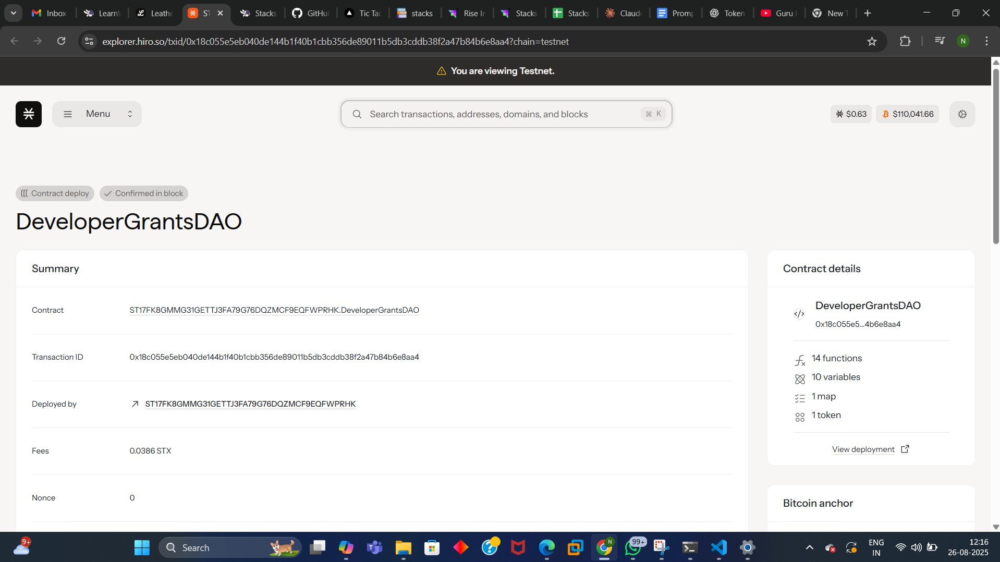

# DeveloperGrants DAO

## Project Description

DeveloperGrants DAO is a decentralized autonomous organization built on the Stacks blockchain that facilitates open-source development funding through a transparent bounty and code review system. The platform enables community members to create development grants, fund projects, and reward developers for their contributions to open-source software.

The DAO operates through a dual-token system where STX is used for funding grants and a governance token (DEV-GRANT-TOKEN) is minted to grant creators, giving them voting power proportional to their contributions to the ecosystem.

## Project Vision

Our vision is to create a self-sustaining ecosystem that:

- **Democratizes Open Source Funding**: Removes barriers between project maintainers and funding sources
- **Incentivizes Quality Development**: Rewards developers based on code quality and community review
- **Builds Transparent Governance**: Uses blockchain technology to ensure all funding decisions are transparent and immutable
- **Fosters Innovation**: Provides a platform where innovative open-source projects can receive the funding they deserve
- **Creates Community-Driven Development**: Enables the community to collectively decide which projects receive funding through governance tokens

## Core Functions

### 1. Create Grant (`create-grant`)
Allows anyone to create a development grant by specifying:
- **Title**: Brief description of the project (max 100 characters)
- **Description**: Detailed project requirements (max 500 characters)
- **Funding Amount**: STX amount to be rewarded upon completion

Features:
- Automatically transfers funding to the DAO treasury
- Mints governance tokens to the grant creator (1:1 ratio with STX funded)
- Assigns unique grant ID for tracking
- Emits creation event for transparency

### 2. Submit Code for Review (`submit-code-for-review`)
Enables developers to submit their work for review and claim rewards:
- **Grant ID**: References the specific grant being fulfilled
- **Submission Hash**: Cryptographic hash of the submitted code
- **Reviewer**: Designated reviewer for code quality assessment

Features:
- Prevents duplicate submissions per developer per grant
- Automatically processes rewards upon submission (demo version)
- Updates grant status through the development lifecycle
- Records submission details for audit trail
- Transfers bounty rewards directly to developers

## Future Scope

### Phase 1: Enhanced Review System
- **Multi-Reviewer Consensus**: Implement voting mechanism for code reviews
- **Review Staking**: Require reviewers to stake tokens for accountability
- **Quality Metrics**: Develop automated code quality assessment tools
- **Dispute Resolution**: Create appeal process for rejected submissions

### Phase 2: Advanced DAO Governance
- **Proposal System**: Allow governance token holders to propose platform changes
- **Treasury Management**: Community voting on treasury fund allocation
- **Fee Structure**: Implement platform fees for sustainability
- **Reputation System**: Track developer and reviewer reputation scores

### Phase 3: Ecosystem Expansion
- **Cross-Chain Integration**: Extend to other blockchain networks
- **DeFi Integration**: Yield farming for treasury funds
- **NFT Certificates**: Issue completion certificates as NFTs
- **Partnership Program**: Integrate with existing open-source platforms

### Phase 4: Advanced Features
- **AI-Assisted Reviews**: Implement AI tools for initial code screening
- **Milestone-Based Grants**: Support for multi-phase project funding
- **Team Collaboration**: Enable team-based grant applications
- **Analytics Dashboard**: Comprehensive platform statistics and insights

## Technical Architecture

- **Blockchain**: Stacks (Bitcoin Layer 2)
- **Smart Contract Language**: Clarity
- **Token Standard**: SIP-010 Fungible Token
- **Governance Model**: Token-weighted voting
- **Treasury Management**: On-chain STX storage

## Getting Started

1. **Deploy Contract**: Deploy the Clarity contract to Stacks testnet/mainnet
2. **Create Grant**: Call `create-grant` with project details and STX funding
3. **Submit Work**: Developers submit code using `submit-code-for-review`
4. **Claim Rewards**: Approved submissions automatically receive bounty payments

## Contract Address Details
Contract ID:
ST17FK8GMMG31GETTJ3FA79G76DQZMCF9EQFWPRHK.DeveloperGrantsDAO

